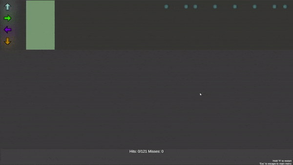
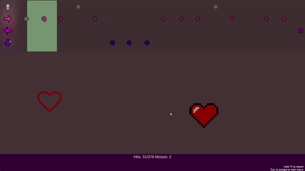

# Dancer
A Unity 2D rhythm game

Use arrows or w,s,a,d to hit moves in rhythm.
Holding 'r' resets level and clicking 'esc' quits to menu.

Custom levels can be created with my another project - MIDI parser.

MIDI parser project:

https://github.com/JakubStrekowski/MIDIparser

You can create different color themes for each level and add simple visual effects

